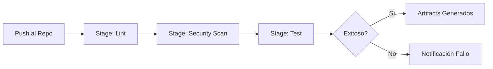
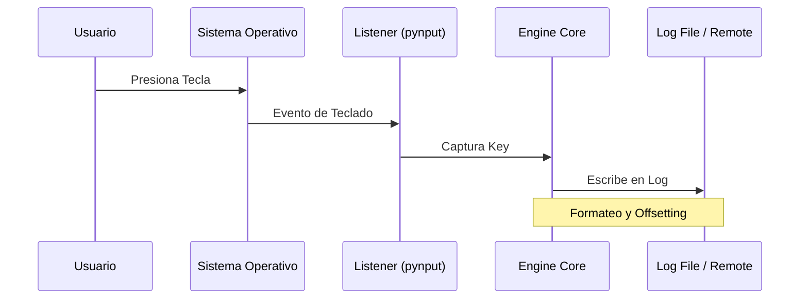

# Diagramas de Flujo del Proyecto

## Pipeline DevSecOps (GitLab CI)

```mermaid
graph LR
    A[Push al Repo] --> B[Stage: Lint]
    B --> C[Stage: Security Scan]
    C --> D[Stage: Test]
    D --> E{Exitoso?}
    E -- Sí --> F[Artifacts Generados]
    E -- No --> G[Notificación Fallo]
```

## Ciclo de Vida del Evento (Modo Activo)

```mermaid
sequenceDiagram
    participant User as Usuario
    participant OS as Sistema Operativo
    participant Hook as Listener (pynput)
    participant Engine as Engine Core
    participant Log as Log File / Remote

    User->>OS: Presiona Tecla
    OS->>Hook: Evento de Teclado
    Hook->>Engine: Captura Key
    Engine->>Log: Escribe en Log
    Note over Engine,Log: Formateo y Offsetting
```
