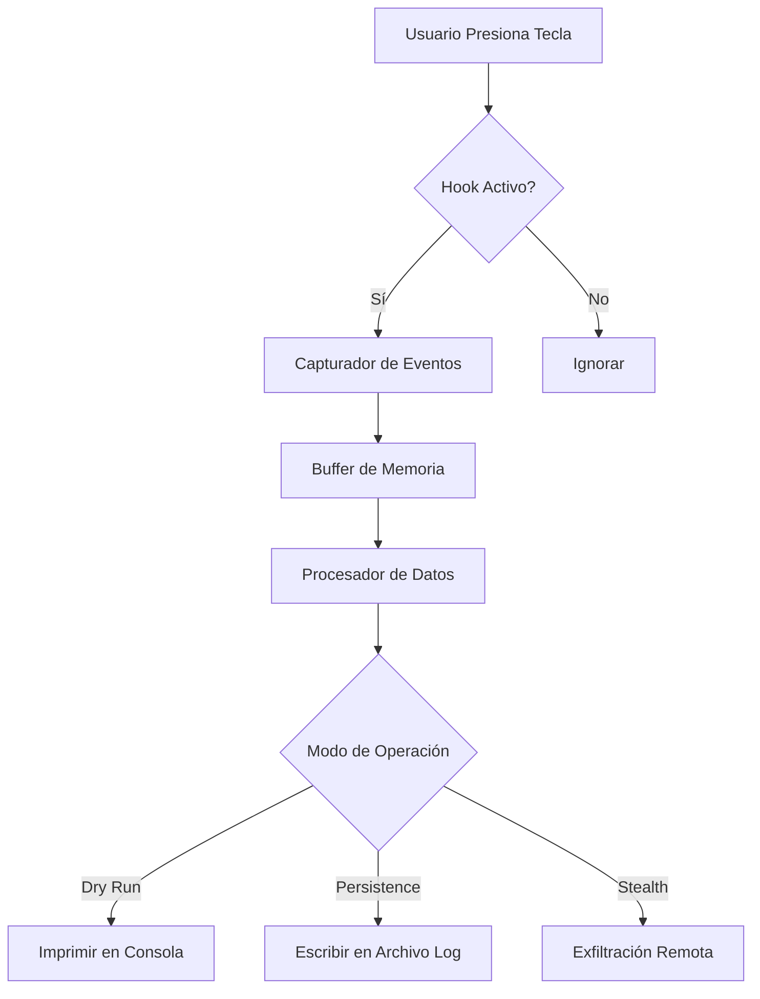

# Arquitectura del Framework Sentinel

Este documento describe la estructura técnica y el flujo de datos del framework.

## Vista General

El framework está dividido en tres capas principales:

1.  **Capa de Captura (Keyboard Hooking):** Interactúa con el sistema operativo para interceptar eventos de entrada.
2.  **Capa de Procesamiento:** Filtra y formatea los datos capturados.
3.  **Capa de Salida (Exfiltración/Logging):** Almacena o envía los datos de manera segura (o simulada).

## Diagrama de Flujo

## Componentes Técnicos

### src/main.py
Maneja la interfaz de línea de comandos (CLI) y la configuración inicial. Permite al usuario seleccionar el modo de operación.

### src/core/engine.py
Contiene la implementación real utilizando librerías como `pynput` o `keyboard`. Este archivo está **ignorado** en el repositorio público de GitHub.

### src/core/examples.py
Contiene una versión simplificada y educativa (pseudocódigo) de la lógica de captura para mostrar el concepto sin proporcionar una herramienta de ataque lista para usar.
